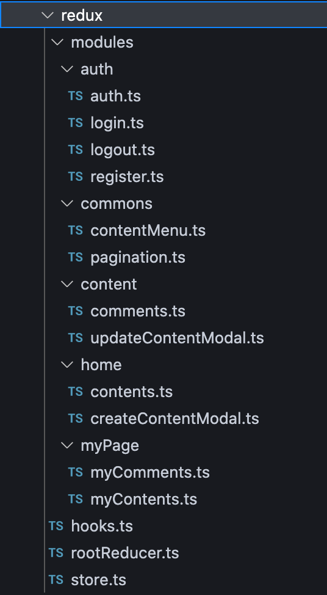
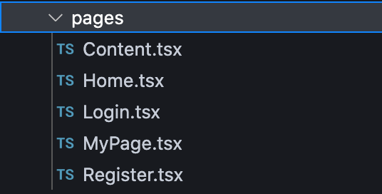
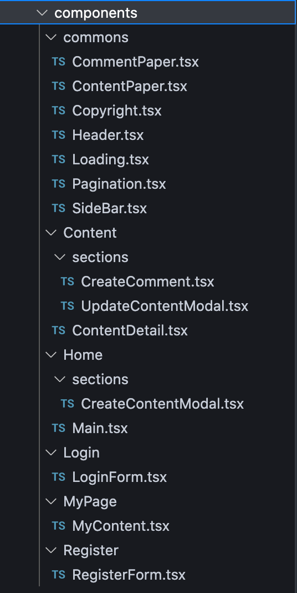
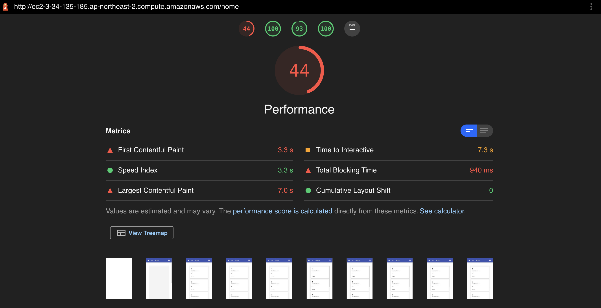
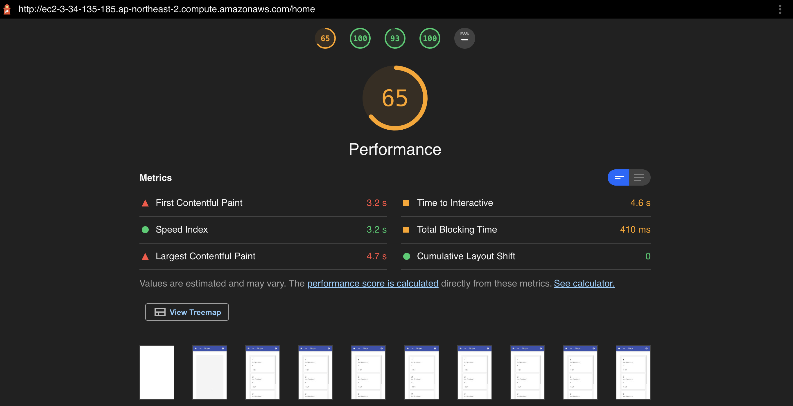

### 들어가며

풀스택 CRUD 게시판을 하나 만들어보자 라는 생각으로 21.08.15에 시작한 동아리 | 소모임 게시판 서비스 Ginger의 코드 [`https://github.com/codeKiuk/Ginger`](https://github.com/codeKiuk/Ginger) 를 천천히 뜯어보며 리팩토링 하기로 마음먹었다.

내가 쓴 코드가 일단 돌아만 가는 ~~개노답~~ 코드라는 걸 알고는 있었지만 뭘 어떻게 만들어야 확장성이 좋은 코드인지, 어떻게 짜는 것이 클-린한지 몰랐다.

그러다가 [`https://jbee.io/etc/what-is-good-code/`](https://jbee.io/etc/what-is-good-code/) 글을 보고 조금의 힌트를 얻어, 선배님이 생각하시는 좋은 코드의 기준인

1. 의존성이 잘 드러나도록 추상화되어 있는가

2. 확장성 있는 컴포넌트인가

에 맞춰 리팩토링을 진행하기로 했다.

### 프로젝트 구조 파악

의존성을 잘 드러내는 추상화 (한 파일이 하나의 목적을 갖도록 로직 분리) 를 이루기 위해서는

우선 프로젝트의 구조를 파악해 어떤 로직들이 존재하고,

이 로직들이 어느 파일에 어떻게 존재하는지 파악하는 것이 먼저다.



redux 구조



Route




Higher Order Components

Ginger 클라이언트 디렉토리는 어떤 기능을 하는지 (component인지, route page인지, redux인지) 에 따라 폴더 구조를 나눴다.

1. 이 구조가 가질 수 있는 문제점은 플젝 규모가 커지면 코드가 정의된 곳과 이를 사용하는 곳이 멀어질 수 있다는 점.. ~~사실 이미 좀 멀어져 있다.~~
2. 또한 MVC라든지 MVVM라든지 디자인 패턴에 대한 지식 없이 구성해서 좋은 의존성에 대한 고민을 많이 못 했다. ⇒ ( components/commons/Pagination.tsx 이라는 컴포넌트 안에 pagination view 로직이 들어있는 동시에 컨텐츠를 가져오는 상태 관련 로직이 동시에 존재하는 등 의존성 분리를 하지 못 했다. )

### 문제 찾아보기

먼저 프로젝트 코드 전반적으로 redux와 thunk를 통해 전역 상태와 data fetch를 다루면서 재사용 가능한 컴포넌트를 많이 만들지 못 했다. (redux 덕분에 자식 컴포넌트에 props를 내려주는 일을 거의 안 하면서..)

그럼에도 불구하고 확장성을 생각한 포인트로는

→ withPaperContainer라는 고차컴포넌트를 통해 동아리 게시판 전체 글을 불러오거나 내가 쓴 글, 댓글을 불러오는 등 컨텐츠를 fetch하는 **중복되는 로직**을 한 곳에서 처리했다.

그렇다면 이 외에 재사용 가능하도록 만들어볼 ~~구린~~ 컴포넌트 혹은 view로직과 상태 로직이 같이 있는 복잡한 컴포넌트를 찾아보자.

> Sidebar

Sidebar에서 메뉴를 클릭하면 클릭한 메뉴가 어떤 메뉴인지 전역 store에 ContentSubject라는 enum 타입을 통해 저장한다. 이후 해당하는 컨텐츠(글or댓글 등)를 불러오는 함수를 dispatch한다.

그런데 Sidebar에서 메뉴 클릭 후 라우트를 mypage 혹은 home으로 옮겨오는데, 이 때 각 라우트를 구성하는 컴포넌트의 useEffect에서도 Sidebar에서와 마찬가지로 컨텐츠를 불러오는 함수를 dispatch한다.

따라서 개발 당시 만들었던 중복 로직을 삭제해줬다.

```tsx
// 수정된 Sidebar.tsx
// 클릭한 메뉴에 따라 전역 store에 알려주는 함수에서 중복 로직 삭제

const onClickContentsMenu = (title: string) => {
  switch (title) {
    case '동아리 / 학회':
      dispatch(setContentSubject(ContentSubject.CLUB_CONTENT))
      // 중복로직 삭제 => dispatch(getClubContents({ page: 1, perPage: perPage }));
      break
    case '스터디 / 소모임':
      dispatch(setContentSubject(ContentSubject.GROUP_CONTENT))
      // 중복로직 삭제 => dispatch(getGroupContents({ page: 1, perPage: perPage }));
      break
    case '내가 쓴 글':
      dispatch(setContentSubject(ContentSubject.MY_CONTENT))
      // 중복로직 삭제 => dispatch(getMyContents({ userID: userID ,page: 1, perPage: perPage }));
      break
    case '내가 쓴 댓글':
      dispatch(setContentSubject(ContentSubject.MY_COMMENT))
      // 중복로직 삭제 => dispatch(getMyComments({ userID: userID ,page: 1, perPage: perPage }));
      break
    default:
      break
  }
}
```

> Pagination

글을 쓰게 된 계기인 ~~개구린~~ 페이지네이션 컴포넌트.

먼저 바뀌기 전 코드를 보자.

```tsx
// Pagination.tsx

export const Pagination: React.FC<{}> = () => {
  const contentsLoading = useAppSelector((state) => state.contents.loading)
  const myCommentsLoading = useAppSelector((state) => state.myComments.loading)
  const myContentsLoading = useAppSelector((state) => state.myContents.loading)

  const loading = contentsLoading || myCommentsLoading || myContentsLoading
  const contentSubject = useAppSelector((state) => state.contentMenu.contentSubject)

  // ...

  const onPageClick = (pageNum: number) => {
    switch (contentSubject) {
      case ContentSubject.CLUB_CONTENT:
        dispatch(getClubContents({ page: pageNum, perPage: perPage }))
        break
      case ContentSubject.GROUP_CONTENT:
        dispatch(getGroupContents({ page: pageNum, perPage: perPage }))
        break
      case ContentSubject.MY_CONTENT:
        dispatch(getMyContents({ userID: userID, page: pageNum, perPage: perPage }))
        break
      case ContentSubject.MY_COMMENT:
        dispatch(getMyComments({ userID: userID, page: pageNum, perPage: perPage }))
        break
      default:
        break
    }

    setPage(pageNum)
  }

  // ...
}
```

대충 봐도 재사용하기 어려운 컴포넌트라는 것을 알 수 있다.

-문제-

1. 사이드바 메뉴 (즉 게시판 종류) 가 늘어났을 때 switch문 안에 case를 추가할 수 있겠으나 가독성이 떨어진다.
2. 또한 Pagination만 하는 컴포넌트인데 컨텐츠를 가져오는 로직이 섞여있어서 유지보수하기 어려워보인다.

   이는 Sidebar에서도 있었던 문제로, 컨텐츠를 가져오는 로직이 여러 군데 퍼져있다.

3. loading 또한 게시판 메뉴가 확장될 때마다 하드코딩해야한다.

따라서 Pagination 컴포넌트의 부모 컴포넌트 역할을 하는 withPaperContainer의 코드를 수정함으로 위 문제를 해결했다.

1. Page를 옮겼을 때 새로 컨텐츠를 가져와야 하는 것은 꼭 필요한 로직이기 때문에 Pagination의 부모 컴포넌트에서 prop으로 getPapers 함수를 넘겨준다. (뒤에서 컨텐츠를 가져오는 상태 로직을 커스텀 훅으로 분리할 예정이다.)
2. 로딩 또한 페이지네이션 컴포넌트가 아닌 부모 컴포넌트에서 처리해준다.

```tsx
// withPaperContainer.tsx

**let getPapers = Function();**

// ...

const renderPapers = () => {

            switch (contentSubject) {

                case ContentSubject.CLUB_CONTENT:
                    dispatch(setTotalDocs(contentsCount));
                    **getPapers = getClubContents;**
                    return renderContents(clubContents);

								case ContentSubject.GROUP_CONTENT:
                    dispatch(setTotalDocs(contentsCount));
                    **getPapers = getGroupContents;**
                    return renderContents(groupContents);
										// ...
// ...

return (
            <>
                <div>
                    {loading && <Loading />}
                    {!loading && renderPapers()}
                </div>
                <br />
                {!loading && <Pagination **getPapers={getPapers}** />}
            </>
        )
```

prop으로 받은 getPapers 함수를 통해 switch문을 삭제했다.

한결 깔끔해진 것 같다.

```tsx
// Pagination.tsx

const onPageClick = (pageNum: number) => {
  dispatch(getPapers({ userID: userID, page: pageNum, perPage: perPage }))
  setPage(pageNum)
}
```

**그런데 위에서 살펴봤듯이 view 로직과 data fetch 로직이 같이 있는 것이 비효율적이라는 생각을 했다.**

그래서 data fetch 로직을 수행하는 custom hook을 만들어서 컴포넌트들이 view 로직만 처리하도록 만들어보자.

### Custom Hook으로 의존성 분리하기

그렇다면 view단 컴포넌트들이 사용하는 상태 관련 로직들이 뭐가 있는지 찾아보자.

1. 로딩 상태 (현재 fetch 중이어서 로딩 상태인지)
2. 선택한 글에 따라 해당 글 상세 정보 가져오기 (댓글, 해당 글 내용, 글 작성자 등)
3. 현재 어느 게시판인지에 따라 data fetch
4. pagination 용 정보 (현재 page, total pages)

글이 길어져, 4에 해당하는 로직을 custom hook으로 추출해서 어떻게 의존성을 분리했는지만 살펴보자.

리팩토링 이전에는 위에서 살펴봤듯이 Pagination 컴포넌트에는 pagination view를 렌더링하는 로직과 더불어 페이지 클릭 시 (혹은 next, before 버튼 클릭 시) 해당 페이지에 맞는 게시글들을 불러오는 상태 로직이 같이 존재했었다.

따라서 view 로직만 남겨두어 가독성을 올려보자.

1. pagination view를 위한 상태 (전체 페이지 수, 현재 페이지, 한 페이지 당 몇 row 등) 를 usePagination라는 커스텀 훅에서 다룬다.
2. 게시글 fetch관련 상태 로직을 useFetchPage 라는 커스텀 훅에서 다룬다.

이렇게 하면 Pagination 컴포넌트에서 상태 로직을 다루지 않고 위 두 custom hook을 구독함으로써 페이지네이션 기능을 구현할 수 있다.

간략한 코드를 보자.

```tsx
// usePagination.ts
export const usePagination = () => {
    **const { getPapers } = useFetchPage();**

    const [page, setPage] = useState(1);
    const [perPage, setPerPage] = useState(10);
    const totalPages = Math.ceil(totalDocs / perPage);
    const [pageList, setPageList] = useState(Array(0));

    useEffect(() => {

        settingPageList(totalPages);

    }, [page])

    const onPageClick = async (pageNum: number) => {
        setPage(pageNum);
        **getPapers(pageNum);**
    }

    const onBefore = () => { }

    const onNext = () => { }

    return { page, perPage, pageList, onPageClick }
}
```

useFetchPage 커스텀 훅으로부터 페이지 클릭 시 해당 페이지의 게시글을 렌더링하는 함수를 받아서 사용한다.

이렇게 하면 상태 관련 로직을 모두 커스텀 훅에서 처리할 수 있다.

아래는 ~~이제야 좀~~ 단순해진 Pagination 컴포넌트의 모습이다.

renderPageList로 view 로직만 처리하고 있어 가독성이 훨씬 좋아졌다.

```tsx
const Pagination = () => {

    const loading = useBoardLoading();
    **const { page, pageList, onPageClick } = usePagination();**

    const renderPageList = () => {
        return pageList.map(pageNum => {

            if (pageNum === page) {
                return (
                    <Button color='primary' variant="outlined" onClick={() => onPageClick(pageNum)}>
                        {pageNum}
                    </Button >
                )
            } else {
                return (
                    <Button onClick={() => onPageClick(pageNum)}>
                        {pageNum}
                    </Button >
                )
            }
        })
    }

    return ( ... )
}
```

위에서 withPaperContainer 라는 부모 컴포넌트를 리팩토링해서 재사용성을 높이고자 했는데, custom hook을 통해 해결하면서 부모 컴포넌트의 구조가 더 간결해졌다.

Pagination 컴포넌트에게 컨텐츠를 불러오는 함수를 내려줄 필요가 없어졌기 때문에 부모 컴포넌트 또한 원래 존재목적대로 렌더링 로직만 남아있게 됐다.

```tsx
// withPaperContainer.tsx

const withPaperContainer = () => {

	const PaperContainer = () => {

					.
					.
					.

		const renderPapers = () => {

            switch (contentSubject) {

                case ContentSubject.CLUB_CONTENT:
                    return renderContents(clubContents);

                case ContentSubject.GROUP_CONTENT:
                    return renderContents(groupContents);

                case ContentSubject.MY_CONTENT:
                    return renderContents(myContents);

                case ContentSubject.MY_COMMENT:
                    return renderMyComments(myComments);

                default:
                    break;
            }
    }

		return ( ... )
	}

	return PaperContainer;
}

```

### 리팩토링 이후





성능 개선을 목표로 리팩토링을 시작한 것은 아니었으나.. 성능 개선에 도움이 된 것 같다.

다음 글은 사이트 성능 개선을 위한 리팩토링을 해보고 써보자,,,
