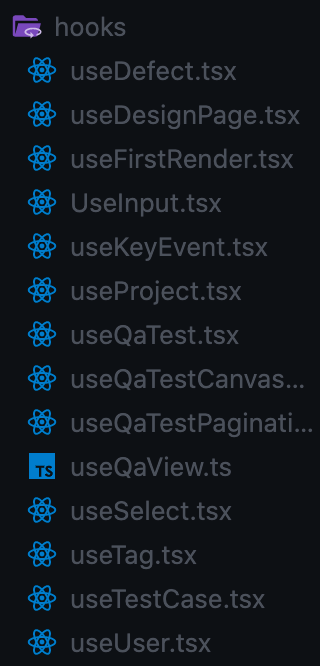

글 한 번 써보라고 하시기도 했고 개인적으로라도 인턴 생활을 되돌아볼 필요가 있어서 쓰게 된 프론트엔드 인턴 회고

아마 기술 얘기보다는 다른 얘기를 하지 않을까.. ~~일단 내 실력이 그지깽깽이잖아?~~

> **들어가보자고**

인턴하면서 개발한 mvp는 프로덕트 개발 프로세스에서 큰 비중을 차지하는 QA 과정에서의 디자이너와 프론트엔드 개발자간 협업을 자동화하여 그동안 있어왔던 비효율을 딥러닝 및 컴퓨터 비전을 통해 없애는 것을 목표로 가지고 있다.

([https://blog.toss.im/article/workflow-revolution](https://blog.toss.im/article/workflow-revolution) - **토스는 그동안 있어왔던 디자이너와 개발자간 협업의 비효율을 어떻게 해결했나?**)

일단 10월 중순에 입사하면서 MVP 개발이 시작되었고 FE,BE 개발자분은 두 분이어서인지 인턴임에도 꽤 많은 부분에서 내가 작성한 코드가 사용되었다. _우와!_

플러스로.. 같이 mvp를 개발한 팀원분들은 이미 엑싯까지 경험하신 분들이라 일하면서 귓동냥으로 프로덕트 기획과 개발 등 스타트업 씬 전반에 대한 인사이트와 에티튜드를 가까이서 느낄 수 있었다. (사실 이게 인턴하면서 얻을 수 있는 최고의 경험이 아닐까..!)

아무튼 내 얘기는 관심없을 테니,, 제품 얘기로 들어가보자

> **이 제품이 왜 기획됐을까**

그래서 네가 참여한 제품이 어떤 니즈때문에 나온건데?

아래 글 **인트로**를 보면 디자이너와 개발자간 협업 비효율에 대한 얘기가 자세하니 이걸로 갈음한다.. (개발 리소스 낭비, 반복적인 디자인 작업, 소모적인 커뮤니케이션)

[https://engineering.linecorp.com/ko/blog/line-design-system/](https://engineering.linecorp.com/ko/blog/line-design-system/) - **개발자와 디자이너의 협업을 위한 LINE 디자인 시스템, LDS 소개**

[위](https://www.notion.so/MVP-f5c829701fe64af9a017a51d81c65a28?pvs=21)에서 이미 첨부한 토스는 **프레이머**를 통해, 라인은 **디자인 시스템 구축**을 통해 디자이너-개발자 협업 문제를 해결했다.

반면에 우리는 디자이너가 만든 피그마 작업물과 개발자가 개발한 개발페이지를 **element 단위로 비교하여 차이점을 분석**해서 제공해준다. 이를 통해 QA 과정에서 **과잉 소통**(QA 내용을 슬랙, 이메일, 문서, ppt 등 다양한 채널을 통해 공유) 과 **불필요한 문서작업**의 문제를 해결하고자 한 것 같다. QA에 더 집중한 거라고 보면 되지 않을까

자세한 기획 배경 문의는 대표님께 해보자.. ~~010-447...~~ ~~근데 이 정도 설명이면 찰떡같이 알아듣지 않나~~

> **그럼** **넌 뭐했는디**

정신없이 1달 반을 달려서 스쿼시 머지만 했는데도 300커밋 넘게 머지한 걸 보고 일을 하긴 했구나싶었다..

- **Custom hook 성애자**

  아무래도 재사용과 확장성에 관심이 있다보니 입사하고 첫 비동기 관련 코드를 작성할 때도 재사용성에 대해 생각하지 않을 수 없었다.

  그래서 saga 코드 작성 후 Custom Hook에 server state를 변경하는 dispatch 함수와 client state를 변경하는 dispatch 함수들을 추상화시켜서 모아놓은 후 PR을 날렸고, 옆자리 차기 CTO 주연님^.^과 custom hook에 대해 얘기를 나눌 수 있었다.

결과적으로 MVP 프로젝트 내에서 좀 사이즈가 있는 기능들 (프로젝트, 테스트 케이스, 테스트 세팅값, Canvas, 테스트 결과관련 체크리스트 등) 을

useTestCase.tsx, useProject, useQaTestCanvasNode 등의 custom hook을 통해 추상화하고 컴포넌트간 로직을 공유했다.

→ custom hook을 사용하면서 좋았던 것은 한 페이지에서 쓰이는 여러 기능들을 하나의 훅 안에 담을 수 있게 되어

협업하면서 코드가 꼬일 일이 적었고, 기획이 수정되거나 버그 픽스를 위해 다른 사람의 코드를 볼 때 custom hook을 먼저 보면서 어떻게 로직을 짰나 빠르게 확인이 가능했다는 점이었다.

- **클라이언트단에서 ~~나름~~ 대용량 데이터 핸들링**

  아무래도 Figma에서 import한 _디자인 작업물 이미지 정보_, _개발페이지 스크린샷 이미지 정보,_ 각 이미지의 *DOM Node 정보*와 더불어 두 이미지간 difference 체크 후 _node difference_ 관련 정보 등을 모두 클라이언트에서 들고 있어야 하고, ~~더 있어?~~
  들고 있는 노드 정보를 통해 Canvas에서 각 노드를 찾아야 하다보니 개발하다가 종종 redux dev tool이 꺼지는 일이 발생했다.
  ~~비행기 체험은 덤 위이이이이잉~~

  서버에서 노드 정보를 그냥 array 로 보내주고 있었기 때문에 노드를 찾을 때 매번 array를 순회하는 게 불필요하다고 생각이 돼서 [Redux Store Normalization](https://redux.js.org/usage/structuring-reducers/normalizing-state-shape) _(공식문서가 정말 자세하니 저는 그냥 지나가겠읍니다.. 그냥 db 정규환데 이걸 이제 클라이언트단에서 하는..예..)_ 을 통해 node들을 node id를 기준으로 분리했고, 이를 통해 노드 각각을 검색하는 데 드는 시간을 줄일 수 있었다.

- **버그 픽스**

  제품을 사용할 때 디자인 페이지와 개발페이지를 불러온 이후 view result (detect difference) 버튼을 통해 에러 체크리스트를 통해 얼마나 두 페이지가 차이나는지 알 수 있는데, 이때 **다른 페이지를 갔다가 다시 돌아오면 에러 체크리스트가 초기화되는 오류**가 있었다.

  이 이슈의 경우 페이지를 옮겼다가 다시 돌아올 때 서버에 요청해서 받는 데이터중에 에러 체크리스트가 오지 않아서 생긴 이슈라고 처음엔 생각했다.
  더 고민해보니 서버 response에 문제가 있다고 생각되지는 않았고 (db 조회를 최소한으로 하는 게 좋다보니!) 이미 서버에서 받은 에러 체크리스트를 **client state에서 저장하지 않고** pagination을 하는 게 문제라고 판단했다.

  따라서 페이지를 옮길 때마다 saga의 select 함수를 통해 기존에 서버에서 response로 받은 에러 체크리스트를 계속 들고 있을 수 있도록 함으로써 해결했다.

- **사용자 경험**

  앞서 [버그 픽스](https://www.notion.so/MVP-f5c829701fe64af9a017a51d81c65a28?pvs=21)에서도 말했듯이 **client state**와 **server state**를 구분해서 생각하는 것이 사용자 경험을 높이는 데에도 도움이 되었다.

  Detect Difference를 하기 전 setting 값을 수정할 때마다 서버에 api를 날리는 구조여서 client state 와 server state를 구분하지 않으면 유저가 setting 값을 변경할 때마다 서버 응답을 받아 체크박스 state가 바뀌게 되므로 사용자 경험에 악영향을 준다고 판단했다.

  그래서 React 어플리케이션과 Redux store에서 사용하는 동기적인 client state와 비동기적인 server state를 나누어 관리하는 걸로 코드를 수정해서 사용자 경험을 향상시켰다.

  잘은 모르지만 [react-query](https://react-query.tanstack.com)가 지향하는 바가 client state와 server state의 분리라는데 실제로 이런 경험을 개발하다가 만나다보니 언젠가는 사용해보고싶어졌다..
