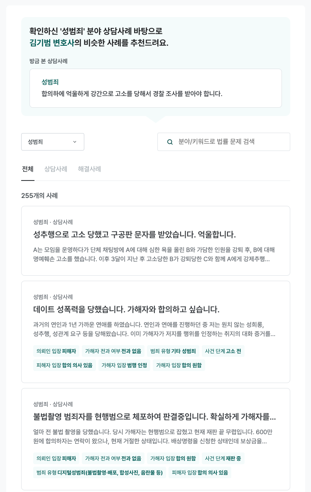

> **react-query**로 _client state와 server state의 분리_ 를 통한 **source of truth**를 실현한 [Tanner Linsely](https://github.com/tannerlinsley)가 만든 다른 오픈소스 프로젝트인 **tanstack-router**를 우연히 접했었는데,
> **tanstack-router**에서 강조한 url search params를 활용한 data fetching orchestration을 간단하게나마 적용해서 재밌었다! (물론 크게 복잡한 작업은 아니어서 tanstack-router 를 적용하진 않았고 plain하게 URL SearchParams를 조작했다.)

**참조**

특정 url에서 볼 수 있는 ?page=3, ?filter=ascending 등 의 url search params는 url search params가 **전역 상태**와 같은 역할을 할 수 있다는 것을 보여준다.

더불어 아래와 같은 이점도 존재한다.

1. 페이지 리로드시에도 동일한 상태를 보여준다.
2. 링크만 동일하다면 누구에게나 동일한 상태를 보여준다.
3. 네비게이션간에 상태 저장이 쉽다.
4. source of truth 원칙을 지키기 쉽다.

- tanstack-router의 [URL SearchParams를 통한 상태 저장에 관한 글](https://tanstack.com/router/v1/docs/guide/search-params)
- tantack-router의 [data fetching orchestration](https://www.notion.so/URL-SearchParams-react-query-data-fetching-orchestration-e6c5460b07274e48af30a381c46f3747?pvs=21)

---

아무튼간 배경부터..

### 스프린트의 시작

변호사 프로필 페이지를 개선하기 위한 스프린트 플래닝을 할 때 기존에 Vue2로 되어 있는 코드베이스를 Next로 마이그레이션하는 작업도 포함해서 개발하자고 얘기가 되었다.

그래서 아래와 같은 순서로 개발이 진행되었다.

1. 변경된 레이아웃 작업
2. 변경된 UI 작업
3. 기존 기능 동일하게 이식하는 작업
4. 추가된 기능 작업
5. 기존 이벤트 동일하게 이식하는 작업

이 중 4번. 추가된 기능 작업을 할 때 URL SearchParams를 조금 활용해보기로 했다.

### 언제 활용했나!

바로 아래 섹션에서 url search param을 적극 활용하면 react-query를 사용할 때 굉장히 편할 것 같다는 생각을 했다.

현재 유저가 보고있는 변호사 프로필 페이지의 변호사 회원이 쓴 글을 검색할 수 있는 섹션이다.

범죄분야, 검색어, 변호사 회원이 작성한 글의 타입 (상담, 해결) 에 따라 상이한 검색 결과를 보여준다.

즉, 리스트 데이터를 fetch할 때 **여러가지 조건**을 적용하는데 이 조건들을 유려하게 핸들링했어야 했다.

그렇다면 그 여러가지 조건을 조작할 수 있는 영역은 어떤 것들이 있나!

- 범죄분야를 선택할 수 있는 Select Box 영역
- 검색어 input field
- 변호사 회원이 작성한 글의 타입을 변경할 수 있는 (전체, 상담사례, 해결사례로 구성되어 있는) Tab
- Pagination

이렇게 4가지 조건이 합쳐져 리스트를 불러오게 된다.




우리팀은 data fetching 라이브러리로 react-query를 사용하는데, react-query는 선언적으로 사용되게끔 만들어져있다.

그래서 명시적으로 api call 을 refetch하는 기능이 있기보다는, useQuery 라는 함수에 넘기는 **key**값이 변경되면 **알아서 data를 fetch/refetch**하는 형식이다.

그렇다면 useQuery의 refetch가 위에서 말한 **여러가지 조건들에 의존적일 때** 어떻게 다루면 편할까?

fetch/refetch는 _query key값이 변경되면 자동으로 수행_ 된다고 했다.

그러면 **query key를 편하고, 전역적으로 다루면 될 것 같다**….

는 생각에 리로드나 네비게이션간에도 상태가 유지될 수 있고 간편하게 조작할 수 있는 url search params를 활용했다.

*검색어*가 바뀌거나, 셀렉트 박스의 *범죄분야*가 바뀌거나, 리스트의 *페이지*가 바뀌거나, 상담사례인지 해결사례인지 *리스트의 타입*이 바뀔 때마다 `?query=something&page=3&listType=column` 등으로 search params가 변경되면,

react-query 의 쿼리들 중 query, page, listType 등의 key값과 매칭되는 value 에 **의존적인 쿼리들**이 자동으로 data를 fetch/refetch\* 하게 된다.

예를 들어 이런 식이다.

```tsx
***useLawyerContents.tsx***

...

// pagination을 다루는 Hook
const { currentPage, moveTo } = usePagination()

// 변호사 프로필 페이지에서 쓰이는 url searchParams를 핸들링하는 Hook
const { lawyerId, contentsType, contentsId, from, query, subCategory,
 setContentsType, setQuery, setSubCategory, ...rest }
    = useLawyerProfilePageUrlParam()

// 특정 변호사 유저가 작성한 모든 컨텐츠(해결사례, 상담사례)를 불러오는 Query
const { data: integratedLawyerContentsData } = useGetSimpleSearchResultQuery({
    // variables 객체를 통해 queryKey를 만든다.
    // -> variables의 키값들이 변경되면 useGetSimpleSearchResultQuery가 재실행된다.
    variables: {
      engineName: ELASTIC_SEARCH_ENGINE['integrated-lawyer-contents'],
      searchQuery: query,
      filters: { lawyer_id: [parseInt(lawyerId)] }
      currentPage: currentPage + 1,
      size: LAWYER_PROFILE_PAGE_ENGINE_SIZE['integrated-lawyer-contents'],
    },
    options: {
      enabled: contentsType === CONTENTS_SECTION_TAB_TYPE['전체'],
    },
  })

return { integratedLawyercontentsData, ... }

...
```

### 결론

이미 서버 상태는 react-query에 맡겨둔 상태이니, react-query를 어떻게 편하게 조작할까? 에서 시작된 search params 활용.

react-query의 data fetch/refetch를 결정하는 **_query key_**값을 전역 상태인 url search params로 조종함으로써 [위 참조글](https://www.notion.so/URL-SearchParams-react-query-data-fetching-orchestration-e6c5460b07274e48af30a381c46f3747?pvs=21)에서 tanstack-router 가 말한 **_data-fetching orchestration_** 을 단순하게나마 경험할 수 있었다.
