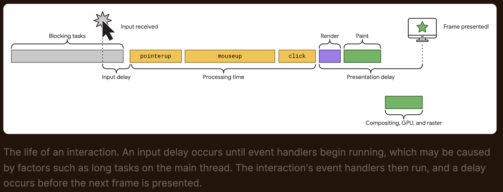
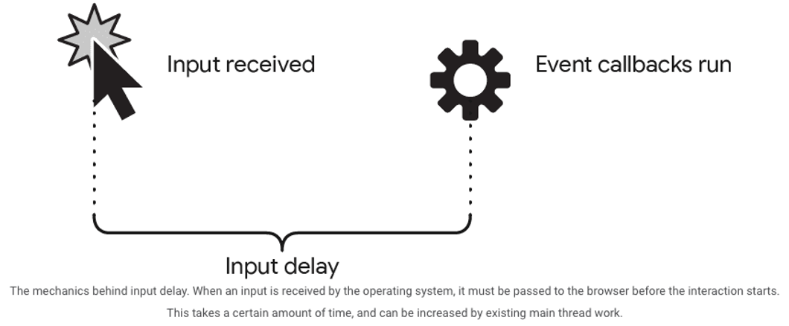
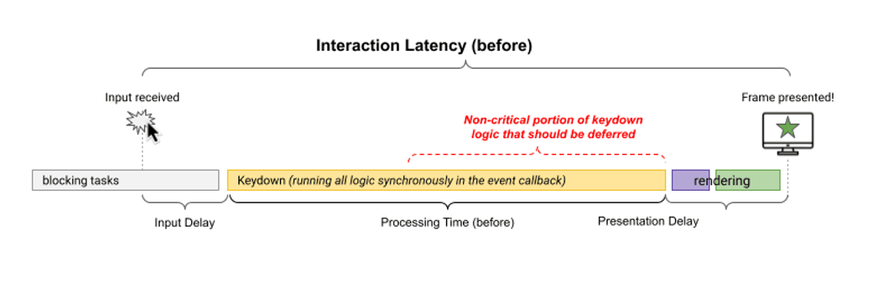
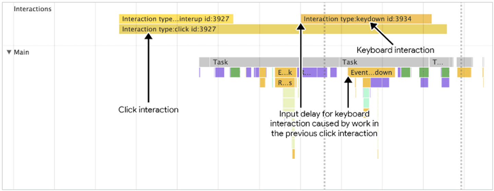
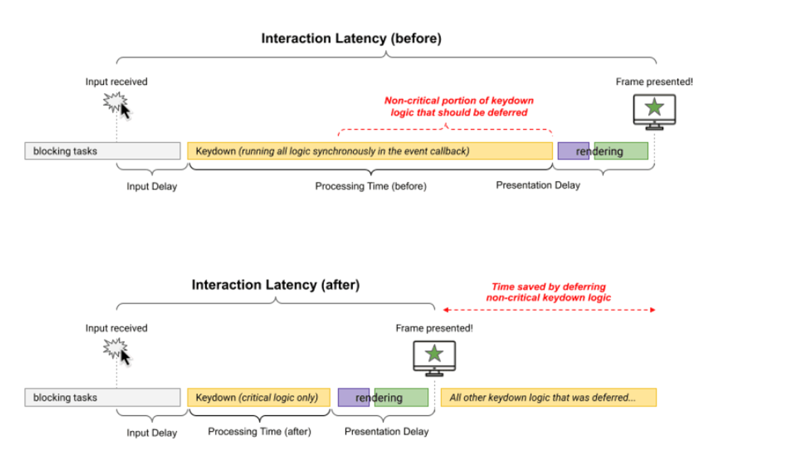
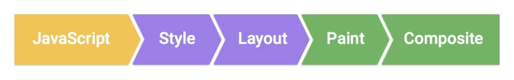

# INP

> [https://web.dev/articles/inp](https://web.dev/articles/inp)

위 아티클을 보면 INP란 무엇인지 디테일하게 알 수 있습니다.

하지만 바쁜 우리들을 위해 간단하게 정리된 걸 먼저 보고 읽으면 좋을 것 같조??

## INP란

> Overview

사용자의 페이지 방문 기간동안 발생하는 모든 클릭, 탭, 키보드 등 **상호작용**의 latency를 관찰
→ 페이지의 전반적인 반응성을 평가하는 지표.

> INP를 측정할 때 관찰하는 상호작용(user interaction)

- **_Clicking_** with a mouse.
- **_Tapping_** on a device with a touchscreen.
- Pressing a key on either a physical or onscreen **_Keyboard_**.

## Why INP?

> _Chrome usage data shows that 90% of a user's time on a page is spent after it loads, Thus, careful measurement of responsiveness throughout the page lifecycle is important._

유저가 페이지에서 사용한 시간 중 90% 는 페이지가 로드된 이후.
페이지 라이프사이클동안의 반응성이 중요하기 때문에 INP를 도입하기로 한 것

>

## INP vs FID



> FID

1. first interaction의 Input delay가 작으면, 좋은 first impression을 가졌다! 라는 것
2. main thread의 long task에 의해 first input delay 가 결정된다.
3. input 에 의해 next frame이 그려지는 delay를 측정하지 않는다.
4. input에 의해 실행된 event handler의 시간을 측정하지 않는다.

## INP가 측정하는 것

> _the intent of INP is not to measure all the eventual effects of the interaction (such as network fetches and UI updates from other asynchronous operations), but the time in which the next paint is being blocked.
> → <_ 유저의 행동 이후 시각적 피드백이 얼마동안 block되느냐만 보면된다! _>_

ensure the time from when a user initiates an interaction until the next frame is painted

→ < 얼마나 빠르게 유저의 interaction에 반응하여 next frame을 그려주냐 >

---

# INP 최적화하기

> _어쨌든 중요한 건 어떻게 INP를 개선하냐!_

## Interaction 쪼개보기

1. **Input Delay**

   user initiates an interaction ↔ ends when the event callbacks begin

   

2. **Event Callback _( Processing Time )_**

   time for event callbacks to run

   

3. **Presentation Delay**

   time for the browser to present the next frame _( visual result of the interaction )_

**_위 세개의 phase의 합산 === Total Interaction Latency_**

<aside>
💡💡💡 그래서 INP 최적화는 곧 위 세 개의 phase를 최적화한다는 것
</aside>

## Optimize Input Delay

> Input Delay 줄이기
> [https://web.dev/articles/optimize-input-delay](https://web.dev/articles/optimize-input-delay)

간략하게 요약하자면, Input Delay를 줄이려면 아래 세 가지를 하라고 합니다.

### recurring timers를 피해라 _(_ `*setInterval*` _)_

<aside>
💡 setInterval 사용할 때 main thread를 너무 잡아먹지 않게 setInterval 내에서 하는 일을 줄이라는 게 요지인 듯 합니다.

</aside>

### 메인 쓰레드에 돌아갈 코드를 잘게 쪼개라 _( breaking up long tasks )_

```jsx
textBox.addEventListener('input', (inputEvent) => {
  // UI 업데이트를 다음 프레임에서 바로 볼 수 있도록
  // UI 업데이트는 즉각적으로 하기
  updateTextBox(inputEvent)

  // Use `setTimeout` to defer all other work until at lehast the next
  // frame by queuing a task in a `requestAnimationFrame()` callback.
  requestAnimationFrame(() => {
    setTimeout(() => {
      const text = textBox.textContent
      updateWordCount(text)
      checkSpelling(text)
      saveChanges(text)
    }, 0)
  })
})
```

### Interaction Overlap 의 문제

1. network 요청때문에 느리다면, Debouncing, `AbortController`의 fetch abort로 해결해라
2. 애니메이션때문에 느리다면, JS 애니메이션 말고 css를 사용하고, composition 애니메이션으로 해결하려고 노력해라



> after you've interacted with one element,
> you make another interaction with the page before the initial interaction has had a chance to render the next frame.

---

## Optimize Event Callback _( Processing Time )_

### Visual Updates 이외의 task들은 Yield하기

> 아래와 일맥상통하는 얘기
> 메인 쓰레드에 돌아갈 코드를 잘게 쪼개라 _( breaking up long tasks )_

다만 여기서는 `requestAnimationFrame`을 사용해서, visual feedback을 블락하지 않는 것에 더 초점을 두었네요!

위 Optimize Input Delay에서 썼던 코드보다 더 큰 장점은, `requestAnimationFrame`을 통해 UI update와는 무관한 코드가 next frame을 블락하지 않도록 하면서, 모든 브라우저에서 동작한다는 거라네요



### 레이아웃 Thrashing 줄이기

> [https://web.dev/articles/avoid-large-complex-layouts-and-layout-thrashing](https://web.dev/articles/avoid-large-complex-layouts-and-layout-thrashing)

Layout Thrashing?
_-forced synchronous layout-_
**JavaScript로 스타일을 업데이트할 때 발생**

>



원래는 JS run → style calculation → layout 인데, Layout Thrashing이 발생하면
JS run → style calculation → layout → JS run → style calculation → layout 이 된다

```jsx
function logBoxHeight() {
  console.log(box.offsetHeight)

  box.classList.add('super-big')

  //  console.log(box.offsetHeight);
}
```

---

## Optimize Presentation Delay

### DOM size 최소화

> [https://web.dev/articles/dom-size-and-interactivity](https://web.dev/articles/dom-size-and-interactivity)

DOM size 와 rendering work 는 linear한 관계는 아니라고 하네요 ㅎㅎ

DOM size가 크다의 기준?
[Lighthouse에 따르면 1,400개의 노드를 넘으면 크다고 봅니다](https://developer.chrome.com/en/docs/lighthouse/performance/dom-size/#how-the-lighthouse-dom-size-audit-fails)

>

1. Flattening DOM Structure

```html
<div>
   
  <div>
       
    <div>
           
      <div>
               
        <!-- Contents -->
             
      </div>
         
    </div>
     
  </div>
</div>
```

컴포넌트 기반 라이브러리 사용중이면 `Fragment` 적극 활용해라!

### DOM size를 줄일 수 없다면?

1. Additive Approach

> lazy load HTML에 관한 얘기

(첫 렌더때 모든 HTML을 가져오지 않고 필요할 때만 가져오는 이 방식에서)
주의할 점은 user interaction에 대해 HTML을 가져올 때, in-flight network request는 INP를 계산할 때 제외되지만, ui latency가 있을 수 있다
→ skeleton 등으로 해결해야함

>

1. CSS-selector 복잡도 줄이기

> [https://web.dev/articles/reduce-the-scope-and-complexity-of-style-calculations](https://web.dev/articles/reduce-the-scope-and-complexity-of-style-calculations)

```css
.box:nth-last-child(-n+1) .title {
  /* styles */
}
```

BEM 스타일을 사용하는 이유 : 단순한 CSS selector 사용을 위해.. → 성능 이점도 존재했다!

1. `content-visibility` 사용하기

> [https://web.dev/articles/content-visibility](https://web.dev/articles/content-visibility)

- 첫 렌더때 rendering work를 줄여준다
- user interaction으로 인해 DOM이 변경될 때 offscreen 엘리먼트들의 rendering work를 스킵한다

### **Be aware of performance costs when rendering HTML using JavaScript**

> [https://web.dev/articles/client-side-rendering-of-html-and-interactivity](https://web.dev/articles/client-side-rendering-of-html-and-interactivity)

```jsx
async function saveSettings() {
  // Create an array of functions to run:
  const tasks = [validateForm, showSpinner, saveToDatabase, updateUI, sendAnalytics]

  // Loop over the tasks:
  while (tasks.length > 0) {
    // Shift the first task off the tasks array:
    const task = tasks.shift()

    // Run the task:
    task()

    // Yield to the main thread:
    await yieldToMain()
  }
}
```
